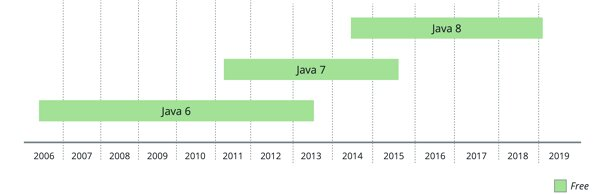
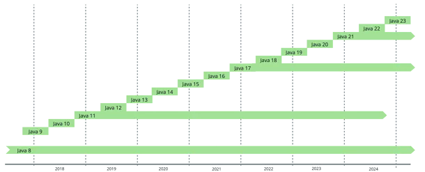

## News in the Java Ecosystem

---
### OpenJDK Release Process (old)

release and Lifecycle of Java 6, 7 and 8

---
### OpenJDK Release Process (old)
- lifecycle defined through availability and free security updates of the version
- always one timeframe where two releases receive free security updates
  - time for migration to new version
- time between releases differs
  - pre defined scope of releases
  - released when all ready to go live
  - very long time between releases

---
### OpenJDK Release Process (new)

- a new release every six months
- long-term Support (LTS) and short-term support(STS)
  - STS, lifecycle of six months until the next release
  - LTS, longer maintenance and free security updates

---
### OpenJDK Release Process (new)
- might contain no new features, but security updates
  - new features might be in preview mode, activate with `--enable-preview`
- since Java 17, LTS release every second year
- after OpenJDK release, distributions are created
  - e.g. Eclipse Temurin, Oracle JDK, Azul Zulu, ...
  - sources may be adjusted, e.g. bundled with JavaFX

---
### Alternative JVM Languages

- initial publications all during old release process
    -  Groovy: 2003
    -  Scala: 2004
    -   Clojure: 2007
    -  Kotlin: 2011

- no significant new publications since new release process
- good balance between new features, stability and compatibility

---
### OpenJDK Distributions
- more than 20 different distributions
- might differ in support, updates, compliance, cost, performance and features

---
### OpenJDK Distributions - Updates
- not every distribution has STS and LTS versions, e.g. Dragonwell
- some distributions backport fixes to extend support times, e.g. Azul
- 4 updates a year, e.g. 17.01, 17.02, ...
  - critical patch update (CPU), fixes vulnerabilities and critical issues
  - patch set update (PSU) contains CPU, new features and fixes noncritical issues
  - CPU only from Azul, Bellsoft and Oracle - paid!

---
### OpenJDK Distributions - Compliance
- compliance ensured using Technology Compatibilty Kit (TCK)
  - tests features which are likely to differ across implementations, e.g. hardware or OS specific
  - lot of work to run the tests
  - Coretto, Oracle JDK, RedHat, Zulu, Temurin, ... are ususally compliant

---
### OpenJDK Distributions - Performance
- performance mostly equal throughout the distributions
  - high perfomance distributions, Azul Platform Prime, different garbage collector and compiler

---
### OpenJDK Distributions - Features
- might bring different features
  - some bundled with JavaFX, e.g. ZuluFX, LibericaFX
  - Coretto, uses Snapstart for faster startup times
  - GraalVM, ahead of time compilation for native image builds

---
### OpenJDK Distributions - Further
- Further information:
  [Gerrit Grunwald: Welcome to The Jungle - A Safari Through The JVM Landscape](https://www.youtube.com/watch?v=QtpH0YbGRd4)

---
### J2EE, JavaEE, JakartaEE 
- specification defining certain APIs
  - e.g. Bean Validation, Jakarta Server Faces, Jakarta Server Faces, ...
- formerly maintained by Oracle
- 2017 announced submit to Eclipse Foundation
- "Java" is trademarked - renaming to Jakarta
- also namespace change from javax.* to jakarta.*
---
### New Garbage Collector
- [JEP 377](https://openjdk.org/jeps/377)
- released: JDK 15
- will be default garbage collector in the future
  - will deprecate G1
- great for highly parallelized apps
- small pause times, higher runtime overhead
  - better response times, less performance
- Further information:
  [Gerrit Grunwald: Trash Talk - Exploring the Memory Management in the JVM](https://www.youtube.com/watch?v=HCcq6VLuXe0)
